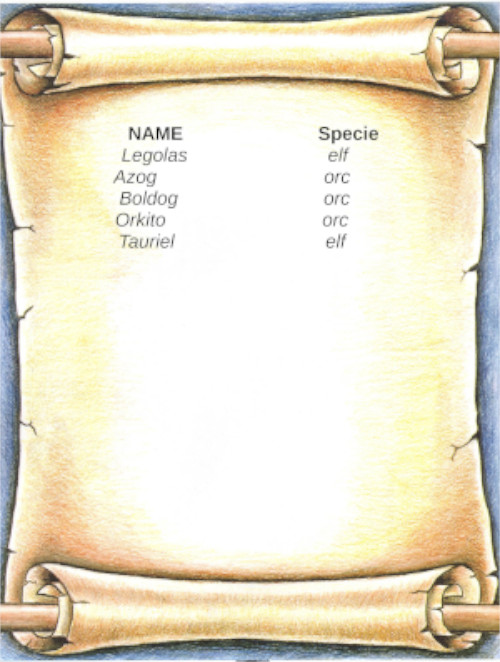
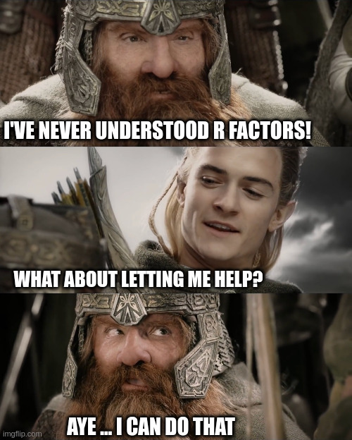
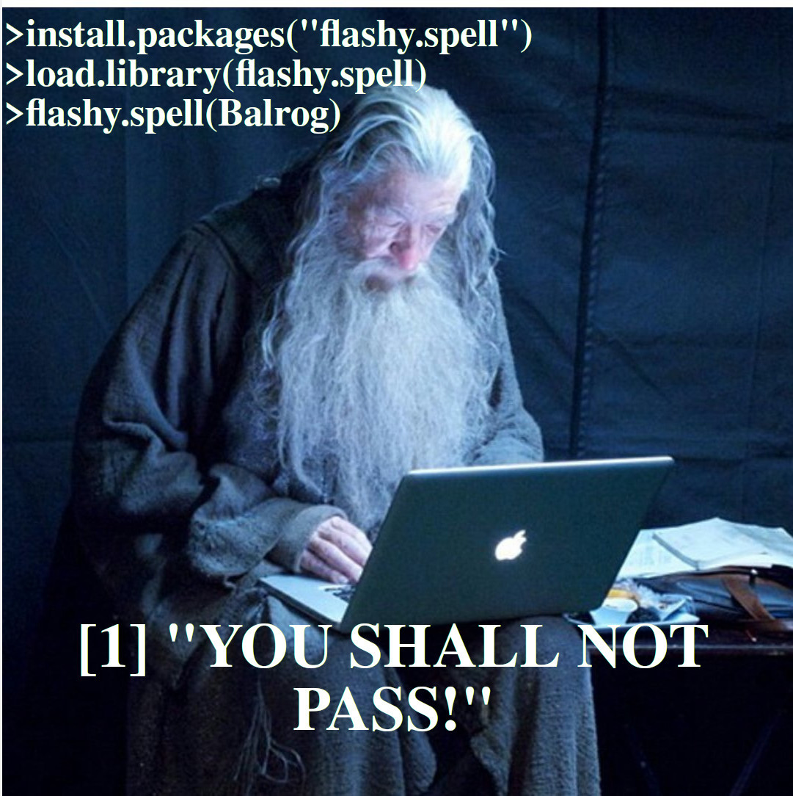
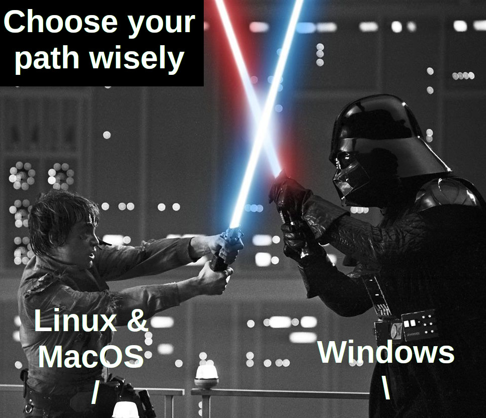

```{r setup, include=FALSE}
knitr::opts_chunk$set(echo = TRUE)
```

Hi!

Let's start our R Jedi path.

### There is no emotion, there is peace.

### There is no ignorance, there is documentation.

### There is no passion, there is serenity.

### There is no chaos, there is a bug.

### There is no death, there is autosave


# Anyway what are R and R-studio?

Long story short, R is a programming language developed with a special
affinity for statistical purposes. R is open source and cross-platform
(e.g., works for Linux, Mac-OS, and Windows).

You can do almost anything with it, thus it is specially know for **cool
pretty plots** after doing **amazing stats**!

So, R is a high order programming language. That means it's the language
where we humans can tell the computer what to do, while using human-like
syntax and words (i.e., *for*, *if*, *while*, ...) instead of computer's
binary language (i.e., 01001101 01100001 01111001 00100000 01110100
01101000 01100101 00100000 01100110 01101111 01110010 01100011 01100101
00100000 01100010 01100101 00100000 01110111 01101001 01110100 01101000
00100000 01111001 01101111 01110101 00100001)

-   **Wait a moment! So we don't program in R-studio?**
-   **Yes, but actually no**

R is a programming language that translates some plain files (e.g., .R,
.txt, .csv) where we write commands for it to tell them to our computer.
RStudio, in turn, is a nice Graphical User Interface (GUI) that is way way more 
informative than looking at plain files because:

1- You can load several plain text files

2- You can browse your directory

3- You can auto complete variables, do spelling check and debugging

4- You can explore and visualize variables and their content

# R as a calculator

Now that we are starting to use R. So, first you can know that R can be
used like a really powerful calculator that in the future will help us to
write/solve otherwise bothering ANOVAs or Linear models (i.e.,
Linear regression, multiple regression, Linear Mixed models)

## Sum

```{r}
100 + 99
```

## Substraction

```{r}
100 - 99
```

## Division

```{r}
2024 / 360
```

## Multiplication

```{r}
2024 * 360
```

## Exponentiation

```{r}
2 ** 3
```

## Scary things

*Remember: PEMDAS (Parenthesis, Exponents, Multiplication, Division,
Addition, Subtraction)*

```{r}
(2024 * 360) + (2024 / 4)

```

Wow! look at us, using our powerful machine to do some maths. This may
seem trivial, but during your coding experience, you are going to use
operations like the aforementioned, thus with **variables** -*trembles*-.

# Variables

A variable is a data item. Imagine you are an elf with *n* amount of
magical points. It may be the case that you want to infuse with your MP
some objects. For example, you infuse a sheet with the word *HEAL* with
*healing* magic.

In this case the variable named *HEAL* contains the magic *healing*. You
can name your sheets of papers however you can, thus it is always useful
to have names that remember you what they contain. You only have one
restriction, you can not use the exactly variable word twice or it may be
overwritten -i.e., your variable will only contain the last magic spelled, the
first one will be lost as Nemo.

In R we can name our variables as we want, thus we can not start to name
them with numbers, capitals or special characters. Special characters
besides . or \_ are not recommended.

```{r}
# First of all, as you can see this line gives no instruction to R. However, R 
#doesn't yell at us. Why? Because it's a comment, so R knows that this is only 
#for us humans to read. In R we use the hash tag symbol to start a comment

#lets make our first variable!

my.number <- 10 #this means I have a variable called my.number that contains the number 10

my.letter <- "a" #this means I have a variable called my.letter that contains the string a (how we call text in programming)
# as you can notice, strings are defined by being surrounded by quotes (smart!)

robotaren.agurra <- "HELLO WORLD" #Strings can be really long!

print(robotaren.agurra)# we are running our first command! 


```

You may not have noticed, but we run our first command! We asked the
computer to print within the console the string contained in
"robotaren.agurra" **Mind Blown!** We've unlocked our first jedi trick!

In R it's tradition (*it's the law*) that when we have multiple words to
name a variable we use a dot to separate them. Also, we use the symbol
*\<-* intead of = . Do not worry if you do not do so, there is no intergalactic
R police after all, but you can be object of nerdy disapproval looks *sigh*.

We have already defined some variables with different data types. Do you
know which type they are? If you are like me and have the memory power of Dory
from finding Nemo, you will explore which data type you are working
with. Luckily R developers have us covered

```{r}
class(my.number) # I'm asking the class of whats inside the variable my.number

class(my.letter)# I'm asking the class of whats inside the variable my.letter

#now I'm gonna create a new data type, a Factor *mind blown*

my.factor = as.factor("level")

class(my.factor)
```

During your statistical Jedi trip, you will encounter this type of
elements most of the time. Numeric and characters R classes are kinda
self-explanatory, but

-   **What is a factor?**

-   I'm glad that you asked! Long story short, **I do not know**

Factors are this really weird R class type that helps us to
differentiate between element types. Imagine you have a scroll with the
names of all the elves and orcs living as friends inside a village
(*It's my example, and I want them to be friends*).



OK, inside your scroll you have the villagers' names and their specie. In this
example Specie would be a factor class. This is because it's not a value
that we can change (sorta). An elf is an elf, despite of it's height,
hair or being played by Orlando Bloom.



------------------------------------------------------------------------

## Data structures

My fellow padawan, I sense the R force is strong in you! You may be
asking, "Ha, but what if I want many elements inside a variable?" 
We are going places here!

OK, this kind of **structures** that hold data are called *data
structures*. We have one great distinction, we may want structures
containing the same data class or structures with different ones.

Imagine now you want to store a lot of *healing* spells against fire,
PhD burn-out, hangover and fantasy stuff like that (blink blink). Well,
then you need a stone that can store tons of healing spells
(*homogeneous* if you want to sound nerdy).

If you want, instead, to store different type of spells like *healing*,
*explosion*, and *light*, because you want an elvish
swiss-army-spell-rock . Well, then you are looking for a rock that can
hold different spell types at the same time (*heterogeneous*).

### Homogeneous data type

#### vector

Vectors are 1 dimensional data structures (**1D**). Think of it like a
row or things

```{r}
my.numbervector <- c(1,2,3,4,5)

my.stringvector <- c("It's", "a", "trap", "!")

```

```{r}
#this will convert the number to a string because a vector can't contain numbers
# and characters
my.vector=c(1,"2")
```

#### Matrix

Matrix further than being a matrix, they can be seen as several vectors
tied together. This structure is bi-dimensional (**2D**). Kinda like if
you make a boat by gluing wood logs. Thus, every vector has to have
the same length

```{r}
first.log <- c("a","b","c","d")
second.log <- c("1","2","3","4")
my.logmatrix <- rbind(first.log,second.log)

```

Cool, right? \*There is another multi-dimentional homogeneous data
structure called table or array (**n-dimensional**), but we are not
going to speak about these #sorry!

### Heterogeneous data type

#### list

List are 1 dimentional data structures (**1D**) like vectors, but we can
have different data types within

```{r}
my.list <- list(1,"2","3",4)# one way to create a list

my.spellrock.list <- list(heal= "woosh",lives=2, mp.level=10,explosion=c("boom","kaboom"))
#Another way with fancy indexes

print(my.spellrock.list[1])#print first element inside my list

print(my.spellrock.list$explosion)# let's see whats inside $explosion
```

We did a lot here! As you can see, we can store different kind of class
types inside our list. How cool is that (well, not so much TBH, but it's
useful).


#### Data Frame/ Tibble

This is where the fun begins! Data frames are structures (**2D**) where
you can store different data types. This structures are characterized
for having *rows* and *columns*. You know just like what? *Like Excel
spread sheets!*. My padawan, this is the structure that you are going to
use the most within the Data Wars against Null hypothesis. This kind of
structure let us access to complete rows, complete columns, a range
given rows and columns and specific locations.

The mystery of the R force sounds complicated. Let me show you. To
understand this, imagine DataFrames to be as a Battleship board game.

```{r}
# we will need some vector like notation
a.column <- c(NaN,NaN,NaN,NaN,NaN,NaN,NaN,NaN,NaN,"SH")
b.column <- c(NaN,NaN,"S",NaN,NaN,NaN,NaN,NaN,NaN,"IP")
c.column <- c(NaN,NaN,"H",NaN,NaN,"S","H","I","P",NaN)
d.column <- c(NaN,NaN,"I",NaN,NaN,NaN,NaN,NaN,NaN,NaN)
e.column <- c(NaN,NaN,"I",NaN,NaN,NaN,"SHIP",NaN,NaN,NaN)
f.column <- c(NaN,NaN,"P",NaN,NaN,NaN,NaN,NaN,NaN,NaN)
#we will join this vectors to make a data frame
board.game.df <- data.frame(a.column,b.column,c.column,d.column,e.column,
                            f.column)
print(board.game.df)
```

Wuhuu! Now let's play

```{r}
print(board.game.df[1,])#we can select the first row

print(board.game.df[,1])#we can select the first column
# like this
print(board.game.df["a.column"])
# or this
print(board.game.df$a.column)

#Test:what's the difference between board.game.df["a.column"] & board.game.df$a.column

print(board.game.df[3,2:6])# we can select a sub-selection

print(board.game.df[7,5])# we can select one single element

```

------------------------------------------------------------------------

## Functions

If you are a lazy Jedi like myself, you would not like to be typing and
typing. sometimes there are calls within R than can be a program
(*function*). We have already used some of these before: print(),
data.frame(), rbind() !

Let's create one to play after our training!

```{r}
naval.turn <- function(dataFrame,y,x){
  if (dataFrame[y,x] != NaN)  #if whats inside my cell is different from NaN
    {print (dataFrame[y,x])# print whats inside
    print("Boom!")#change content to Boom!
    return(NaN)} # nothing left, In programming languages we say NaN

  else #if what is inside is a NaN
    {print("Ups, you failed")}#arise this print
}
```

The force is really strong in you! For our function we used some English
words. the same syntax we used in *if* and *else* can be used in *for*
and *while* . see below

```{r}
#for syntax= for (element in elementcontainer){do condition}
for (column in board.game.df) { #for every column inside our data frame
  print("running this step")
  print(column) #print everything inside our current selected column
print("changing step") #change to the next column
}
# as you can see, for loop lets us iterate around a fixed and predetermined
# elements of a set (i.e., list, vectors, etc)
```

```{r}
i=0
# we need to start with a predifined 1 value
  while (i<10) { #while the value of is is less than ten
    print(i) #print the value of i
    print("while loop goes BbBrR")
    i=i+1 #sum one unity to the former value of i
  }
#as you can see, while loops have the characteristic of staying in loop WHILE
# the hault condition is not achieved
print("while loop stops")

```

### GAME! turn everything inside board.game.df to NaNs

```{r}
#hint
board.game.df[7,5] <- naval.turn(board.game.df,7,5)
```

------------------------------------------------------------------------

## Libraries



R is a programming language used by tons of people. As so, most of the
times (*almost always*) we do not need to reinvent the lightsaber, because
somebody has already solved our goal and make it available though R
packages. **What are packages** Well, think about it in this way: You are
an elf who wants a spell that will let you eat as much cookies as you want
without gaining weight. In this case you could write your own spell or
search for a *grimoire* with the steps to cast your desire!

In order for R to get a new grimoire you need to do two thing:

1 - Install de package (*get the grimoire*)

2 - Load the package into your working space (*open the grimoire and have it near hand in case you need it*)

Now lets install a package!

```{r}
#In this example we are going to install pacman -package manager- library

install.packages("pacman")#This is the command to install a package, once it's installed, you do not need to do it twice

# As you can see from what you learned, install.packages() is a R core function!
```

Great! we downloaded our first package, but where from? *God, is it you?*
Well, it's downloaded from The Comprehensive R Archive Network(**CRAN** for R jedys
like yourself) <https://cran.r-project.org/>

Now, let's load our package

```{r}
#here we are loading our package with the function library
library(pacman)
# TBH, I do not know why we call it a package before installing, and library afterwards
print("library pacman loaded")
```

Pacman is our yellow ball friend, but also is a package manager (*just
like DHL*) that helps us download and install packages with all the
requirements (*Imagine you have a grimoire written in Dwarf language,
then Pacman will attach the translator from Dwarf to elvish*)

```{r}
#Here we are using pacman to install and load ggplot package.
pacman::p_load("readr","readxl","ggplot2","tidyverse") #library::function
# The interpretation of the above is the following. From library pacman use (aka ::) the function pload
```

### Open .csv files

-   **What are csv files**

-   **CSV files are comma separated files**

Think of a csv like the .txt version of an excel file. We can also load
.xslx files to R with the readxl package and the function read_xlsx()

We can not use correctly de R force to open a file unless we know where it is, right?
Well for that we use a **path**! In Windows it usually stars with **C:** while
in linux and MacOS it may star with **~** or **home**.

Moreover, make sure that you use the correct slash */* to determine the path 
-Yes, I'm talking about you Windows users-.




```{r,}
#read a csv with readr::read_csv()
csv.file <- read_csv("data/Exercise.csv")
#read an excel with readxl::read_xlsx
excel.file <- readxl::read_xlsx("data/Exercise_excel.xlsx")

```

If you put attention, you will look that our .csv and our .xlsx are data frames!
Thus, each column is make from a vector, so you can not have different type of
R classes per column *remember this*.

Data frames are basically what you are going to do while granted the Jedi knight badge. 
during your time as a jedi knight you will load your data, sense the R force, make shinny 
stats that no one will understand, an more. Thus, we can do this with any other
programming language. We are here because R grants abilities some consider to be
un-natural. **cool plots**

### GGplot


GGplot is going to be your best friend! 

GGplot works kinda like photoshop or gimp. You have several layers that you can
edit and overlap to make pretty cool plots.


GGplot intro: https://ggplot2.tidyverse.org/articles/ggplot2.html
GGplot cheatsheet: https://github.com/rstudio/cheatsheets/blob/main/data-visualization.pdf
Check how to change element_text: https://www.rdocumentation.org/packages/ggplot2/versions/2.1.0/topics/element_text


The basics for Ggplot force trick are:

1 You need a data frame
2 Your data has to be long format-like (remember factors?)
3 You have to determine which kind of plot you want (https://ggplot2.tidyverse.org/reference/index.html)
4 You choose your amazing colors


```{r}

ggplot(csv.file, aes(x=x, y=y, shape=dataset, color=dataset)) +# use ggplot over
  #csv.file data frame where x = $x, y=$y ...
  geom_point(size=4)+#the size of the scatter
  scale_color_manual(values = c("#B2008B"))+#wich color we want (this may be a 
  #vector of colors)
  labs(
  x="X axis (random)",#what to put on X axis 
  y="Y axis (random)",#what to put on Y axis
  title="My amazing first jedi plot!")+ #what to put on plot title
  scale_x_continuous(breaks = c(1,100),limits=c(1,100), labels = c("bat",
"ehun"))+#what to show on x axis, stops, limits of the axis and labels over breaks
  scale_y_continuous(breaks = c(1,100),limits=c(1,100), labels = c("bat",
"ehun"))+#what to show on y axis, stops, limits of the axis and labels over breaks
  theme(#theme is an amazing function that lets us make pretty our plots!
  panel.background = element_rect(fill = "white",#white background
  colour = "gray",#plot outline
  linewidth = 0.5, linetype = "solid"),#how is the aspect of the outline, try "dotted"
  panel.grid.major = element_line(linewidth  = 0.5, linetype = 'solid',
  colour = "white"),
  panel.grid.minor = element_line(linewidth = 0.25, linetype = 'solid',
  colour = "white"),
  #We can also change the font, sie ans aspect
  plot.title    = element_text(family = "AppleGothic"),
        plot.subtitle = element_text(family = "AppleGothic",color = "black"),
        axis.title.x  = element_text(family = "AppleGothic",color = "black"),
        axis.title.y  = element_text(family = "AppleGothic",color = "black"),
        axis.text.x   = element_text(family = "AppleGothic",color = "black",angle = 90),
        axis.text.y   = element_text(family = "AppleGothic",color = "black"))
```

------------------------------------------------------------------------

# Exercise


Now its your turn! Your goal is to open the file **numeric_peekaboo.csv**, make a 
plot for each label and replace the label with the correct name of the image shown

```{r}
#your amazing code and plots go here
```


------------------------------------------------------------------------

------------------------------------------------------------------------

##### ref

1 Matejka, J., & Fitzmaurice, G. (2017, May). Same stats, different graphs: generating datasets with varied appearance and identical statistics through simulated annealing. In Proceedings of the 2017 CHI conference on human factors in computing systems (pp. 1290-1294)

2 Molin, S. (2023). stefmolin/data-morph: Data Morph (0.2.0). Zenodo. https://doi.org/10.5281/zenodo.8374121

3 Crameri, F., Shephard, G. E., & Heron, P. J. (2020). The misuse of colour in science communication. Nature Communications, 11, 5444. https://doi.org/10.1038/s41467-020-19160-7

4 Harrower, M., & Brewer, C. A. (2003). ColorBrewer.org: An Online Tool for Selecting Colour Schemes for Maps. The Cartographic Journal, 40(1), 27–37. https://doi.org/10.1179/000870403235002042
