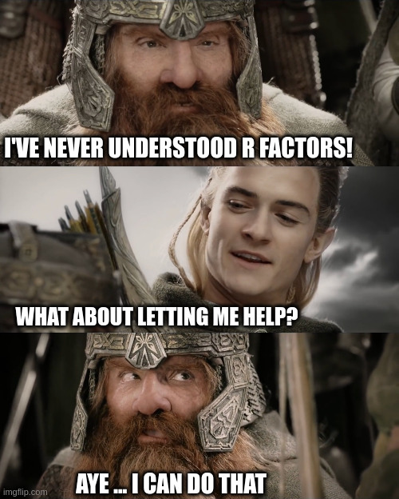

```{r setup, include=FALSE}
knitr::opts_chunk$set(echo = TRUE)
```
Hi! 

Let's start our R Jedi path.


### There is no emotion, there is peace.
### There is no ignorance, there is documentation.
### There is no passion, there is serenity.
### There is no chaos, there is a bug.
### There is no death, there is autosave


# Anyway what are R and R-studio?

Long story short, R is a programming language developed with a special affinity 
for statistical purposes. R is open source and multi-platform (e.g., works for 
Linux, Mac-OS, and Windows). 

You can do almost anything with it, thus it is specially know for 
**cool pretty plots** after doing **amazing stats**!

So, R is a high order programming language. That means its the language where we
humans can tell the computer what to do, while using human-like syntax and words
(i.e., *for*, *if*, *while*, ...) instead of computer's binary language (i.e.,
01001101 01100001 01111001 00100000 01110100 01101000 01100101 00100000 01100110 01101111 01110010 01100011 01100101 00100000 01100010 01100101 00100000 01110111 01101001 01110100 01101000 00100000 01111001 01101111 01110101 00100001)

- **Wait a moment! So we don't program in R-studio?**
- **Yes, but actually no**

R is a programming language that translates some plain files (e.g., .R, .txt, 
.csv) where we write with commands for it. RStudio, in turn, is a nice Graphical 
User Interface (GUI) that is way way more informative than looking at plain files
because:

1- You can load several plain text files

2- You can browse your directory

3- You can auto complete variables, do spelling check and debugging 

4- You can explore and visualize variables and their content

# R as a calculator

Now that we are starting to use R. So, first you can know that R can be used like
a really powerful calculator that in the future will help us from writing/solving
by hand bothering ANOVAs or Linear models (i.e., Linear regression, multiple regression,
Linear Mixed models)

## Sum
```{r}
100 + 99
```

## Substraction

```{r}
100 - 99
```


## Division

```{r}
2024 / 360
```

## Multiplication

```{r}
2024 * 360
```

## Exponentiation

```{r}
2 ** 3
```
## Scary things

*Remember: PEMDAS (parenthesis, exponents, multiplication, division, addition, subtraction)*
```{r}
(2024 * 360) + (2024 / 4)

```


Wow! look at us, using our powerful machine to do some maths. This may be trivial,
but while your coding experience, you are going to use operations like the 
aforementioned, thus with **variables**


# Variables

A variable is a data item. Imagine you are an elf with n amount of magical points.
It may be the case that you want to infuze with your MP some objects. For example,
you  infuze a sheet with the word *HEAL* with *healing* . 

In this case the variable named *HEAL* contains the magic *healing*. You can 
name your sheets of papers however you can, thus it is always useful to have 
names that remember you what they contain. You only have one restriction, yo can
not use the exactly variable word twice or it may be overwritten.

In R we can name our variables as we want, thus we can not start to name them 
with numbers, capitals or special characters. Special characters besides . or _ 
are not recommended. 

```{r}
# First of all, as you can see this line gives no instruction to R. However, R doesn't yell at us. Why? Because its a comment, so R knows that this is only for us humans to read. In R we use the hash tag symbol before 

#lets make our first variable!

my.number <- 10 #this means I have a variable called my.number that contains the number 10

my.letter <- "a" #this means I have a variable called my.letter that contains the string a (how we call text in programming)
# as you can notice, strings are defined by being surrounded by quotes (smart!)

robotaren.agurra <- "HELLO WORLD" #Strings can be really long!

print(robotaren.agurra)# we are running our first command! 


```
You may not have noticed, but we run our first command! we asked the computer to print within the console the string contained in 
"robotaren.agurra"

In R it's tradition (*it's the law*) that when we have multiple words to name a 
variable we use a dot to separate them. Also, we use the symbol *<-* intead of = 

We have already defined some variables with different data types. Do yo know which type?
If you are like me and have the memory power of Dory from finding Nemo, you will
explore which data type you are working with. Luckily R developers have us covered

```{r}
class(my.number) # I'm asking the class of whats inside the variable my.number

class(my.letter)# I'm asking the class of whats inside the variable my.letter

#now I'm gonna create a new data type, a Factor *mind blown*

my.factor = as.factor("level")

class(my.factor)
```

During your statistical Jedi trip, you will encounter this type of elements most
of the time. numeric and characters are kinda self-explanatory, but 

- **What is a factor?** 

- Im glad that you asked! Long story short, **I do not know**

Factors are this really weird R class type that helps us to differentiate between
element types. Imagine you have a scroll with the names of all the elves and 
orcs living as friends inside a village (*It's my example, and I want them to be friends*).


OK, then in your scroll you have their names and their specie. In this example
Specie would be a factor class. This is because its not a value that we can change 
(sorta). An elf is an elf, despite of it's height, hair or being played by Orlando 
Bloom. 




## Data structures

My fellow padawan, I sense the R force is strong in you! You may be asking, 
"Ha, but what if I want many elements inside a variable?" We are going places here! 

OK, this kind of **structures** that hold data are called *data structures*. We 
have one great distinction, we may want structures containing the same data class
or structures with different ones. 

Imagine now you want to store a lot of *healing* spells against fire, PhD burn-out,
hangover and fantasy stuff like that (blink blink). We'll then you would use a stone
that can store tons of healing spells (*homogeneous* if you want to sound nerdy).

If you want, instead, to store different type of spells like *healing*, *explosion*, and
*light*, because you want an elvish swiss-army-spell-rock . Well, then you are looking
for a rock that can hold different  spell types at the same time (*heterogeneous*).

### Homogeneous data type

#### vector

Vectors are 1 dimensional data structures (**1D**). Think of it like a row or things

```{r}
my.numbervector <- c(1,2,3,4,5)

my.stringvector <- c("It's", "a", "trap", "!")

```

```{r}
#this will convert the number to a string because a vector can't contain numbers
# and characters
my.vector=c(1,"2")
```

#### Matrix

Matrix further than being a matrix, they can be seen as several vectors tied together. This structure is bi-dimensional (**2D**).
Kinda like if you make a boat by gluing wood logs. Thus, **every vector has to have the same length**

```{r}
first.log <- c("a","b","c","d")
second.log <- c("1","2","3","4")
my.logmatrix <- rbind(first.log,second.log)

```

cool right! *There'r another multidimentional homogeneous data structure called
table or array (**n-dimensional**), but we are not going to speak about these #sorry!

### Heterogeneous data type

#### list

List are 1 dimentional data structures (**1D**) like vectors, but we can have 
different data types within

```{r}
my.list <- list(1,"2","3",4)

my.spellrock.list <- list(heal= "woosh",lives=2, mp.level=10,explosion=c("boom","kaboom"))

print(my.spellrock.list[1])

print(my.spellrock.list$explosion)
```
We did a lot here! As you can see, we can store different kind of class types 
inside our list. How cool is that (well, not so much TBH, but its useful).


#### Data Frame/ Tibble

This is where the fun begins! Data frames are structures (**2D**) where you can store different data types. This structures are characterized for having *rows* and *columns*. You know just like what? *Like Excel spread sheets!*. My padawan, this is the structure that you are going to use the most within the Data Wars against Null hypothesis. This kind of structure let us access to complete rows, complete columns, a range given rows and columns and specific locations. 

The mystery of the R force sounds complicated. Let me show you. To understand this, imagine DataFrames to be as a Naval Battle board. 

```{r}
a.column <- c(NaN,NaN,NaN,NaN,NaN,NaN,NaN,NaN,NaN,"SH")
b.column <- c(NaN,NaN,"S",NaN,NaN,NaN,NaN,NaN,NaN,"IP")
c.column <- c(NaN,NaN,"H",NaN,NaN,"S","H","I","P",NaN)
d.column <- c(NaN,NaN,"I",NaN,NaN,NaN,NaN,NaN,NaN,NaN)
e.column <- c(NaN,NaN,"I",NaN,NaN,NaN,"SHIP",NaN,NaN,NaN)
f.column <- c(NaN,NaN,"P",NaN,NaN,NaN,NaN,NaN,NaN,NaN)
board.game.df <- data.frame(a.column,b.column,c.column,d.column,e.column,
                            f.column)
print(board.game.df)
```

Wuhuu! Now lets play

```{r}
print(board.game.df[1,])#we can select the first row

print(board.game.df[,1])#we can select the first column
# like this
print(board.game.df["a.column"])
# or this
print(board.game.df$a.column)

print(board.game.df[3,2:6])# we can select a subselection

print(board.game.df[7,5])# we can select one single element

```

## Functions

If you are a lazy Jedi like myself, you would not like to be typing and typing.
sometimes there are calls within R than can be a program (*function*). We have 
already used some of these before: print(), data.frame(), rbind() !

Let's create one to play after our training!

```{r}
naval.turn <- function(dataFrame,y,x){
  if (dataFrame[y,x] != NaN)  #if whats inside my cell is different from NaN
    {print (dataFrame[y,x])# print whats inside
    print("Boom!")#change content to Boom!
    return(NaN)} # nothing left

  else #if what is inside is a NaN
    {print("Ups, you failed")}#arise this print
}
```


The force is really strong in you! For our function we used some English
words. the same syntax we used in *if* and *else* can be used in *for* and *while*
. see below

```{r}
#for syntax= for (element in elementcontainer){do condition}
for (column in board.game.df) {
  print("running this step")
  print(column)
print("changing step")
}
```


```{r}
i=0
  while (i<10) {
    print(i)
    print("while loop goes BbBrR")
    i=i+1
  }
print("while loop stops")
```


### GAME! turn everything inside board.game.df to NaNs

```{r}
#hint
board.game.df[7,5] <- naval.turn(board.game.df,7,5)
```


